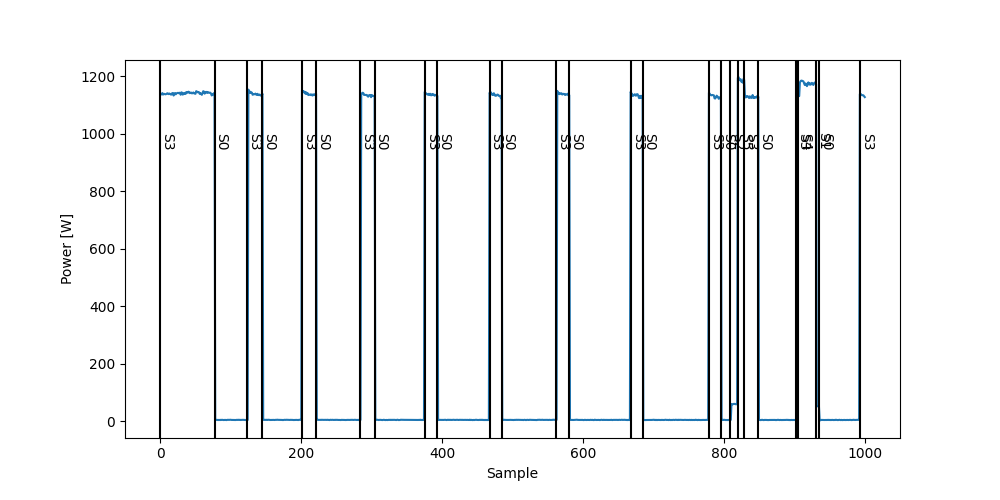

# LLR Event Detector

Appliance event detection based on log likelihood ratio test.

The algorithm is based on work from Pereira et al. [[1]](#1) and Völker et al. [[2]](#2)

## References
<a id="1">[1]</a> 
Pereira, L., (2017). 
Developing and evaluating a probabilistic event detector for non-intrusive load monitoring. 
In 2017 Sustainable Internet and ICT for Sustain- ability (SustainIT). IEEE, 1–10.

<a id="2">[2]</a> 
Völker, B., (2020). 
Annoticity: A Smart Annotation Tool and Data Browser for Electricity Datasets. 
2020 5th International Workshop on Non-Intrusive Load Monitoring, ACM.